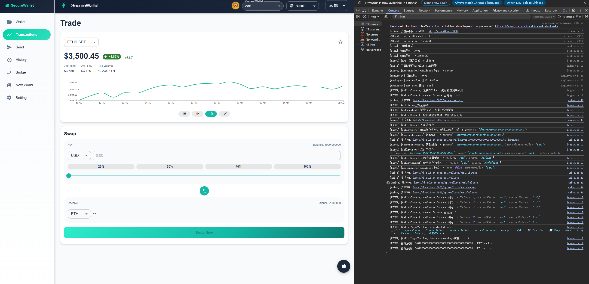
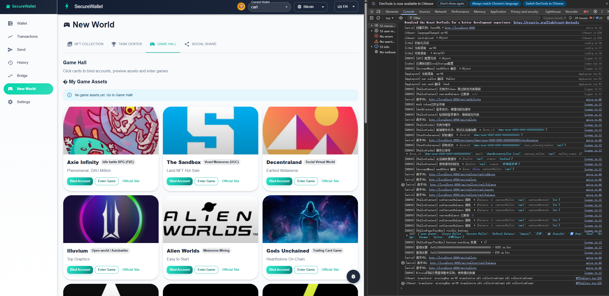

# IronCore - Backend API Server

> 🦀 Enterprise-grade blockchain wallet backend API server

---

## 🌐 Iron Blockchain Wallet Ecosystem

| # | Project | Description | Repository |
|---|---------|-------------|------------|
| 1️⃣ | **IronCore** | 🎯 钱包后端 - Backend API Server | 👉 **[You are here]** |
| 2️⃣ | **IronForge** | 🌐 前端钱包 - Web Wallet | [→ Visit](https://github.com/wejfiowej124234/IronForge) |
| 3️⃣ | **IronLink-DApp** | 📱 移动端 - Mobile DApp Wallet | [→ Visit](https://github.com/wejfiowej124234/IronLink-DApp) |
| 4️⃣ | **IronGuard-AI** | 🤖 AI安全 - AI Security Layer | [→ Visit](https://github.com/wejfiowej124234/ironguard-ai) |
| 5️⃣ | **IronVault-XR** | 🥽 智能眼镜 - AR/VR Wallet | [→ Visit](https://github.com/wejfiowej124234/IronVault-XR) |
| 6️⃣ | **Attack-Defense** | ⚔️ 攻防知识库 - Security Knowledge Base | [→ Visit](https://github.com/wejfiowej124234/Attack-Defense) |

---

## Overview

A REST API server for cryptocurrency wallet management built with Rust. This is the core backend engine powering the entire Iron Blockchain Wallet Ecosystem.

### 🔑 Non-Custodial Architecture

**IronCore never touches your private keys**:

- ✅ **Private keys generated on client devices** - User wallets created in browsers (IronForge) or mobile devices (IronLink)
- ✅ **Transactions signed client-side** - All signing happens on user devices before submission
- ✅ **Backend receives only signed transactions** - IronCore never sees raw private keys or mnemonics
- ✅ **Users maintain 100% control** - Assets cannot be frozen, censored, or accessed by the backend
- ✅ **True self-custody** - Users are solely responsible for backing up their mnemonic phrases

**What IronCore does**:
- ✅ Broadcasts signed transactions to blockchain networks
- ✅ Queries balances and transaction history via RPC
- ✅ Provides multi-chain API abstraction layer
- ✅ Caches blockchain data for better performance

**What IronCore never does**:
- ❌ Never stores user private keys or mnemonics
- ❌ Never signs transactions on behalf of users
- ❌ Never has custody of user assets
- ❌ Never requires KYC or can freeze accounts

### 🏢 Enterprise-Grade Infrastructure

- **High Availability**: 99.9% SLA with multi-node deployment and automatic failover
- **High Performance**: Async I/O, connection pooling, Redis caching - millisecond response times
- **Security**: JWT authentication, rate limiting (100 req/min), DDoS protection
- **Scalability**: Microservice architecture, horizontal scaling, load balancing
- **Monitoring**: Prometheus + Grafana real-time monitoring, < 5 min incident response
- **Audit & Compliance**: Complete operation logs, SOC2 compliance ready
- **Developer-Friendly**: 46+ REST API endpoints, comprehensive documentation, 900+ test cases

---

## 📸 Screenshots

> Frontend applications powered by IronCore Backend API

### Dashboard - Wallet Overview


*Multi-chain wallet dashboard with real-time balance, transaction history, and quick actions*

---

### Send Transaction


*Secure transaction sending with gas estimation and risk detection*

---

### Transaction History


*Complete transaction history with filtering and search capabilities*

---

### Token Exchange


*Real-time token swap with price charts and liquidity pools*

---

### Cross-chain Bridge


*Cross-chain asset transfer with automatic routing and best rates*

---

### GameFi & NFT Hub


*GameFi assets and NFT management integrated with wallet*

---

### Settings & Configuration


*Backend API configuration, health monitoring, and security settings*

---

## Features

### 🔗 Multi-Chain Support

- **Currently Supported** ✅:
  - **Ethereum** (Mainnet & Sepolia) - secp256k1
  - **BSC** (Mainnet & Testnet) - secp256k1
  - **Polygon** (Mainnet & Mumbai) - secp256k1
  - **Bitcoin** (Mainnet & Testnet) - secp256k1

- **Coming Soon** 🔥:
  - **Solana** (~1 week) - ed25519 + SLIP-0010
  - **Cosmos** (~3 days) - secp256k1 + Bech32
  - **Cardano** (~3 weeks) - ed25519 + CIP-1852
  - **Polkadot** (~2 weeks) - sr25519 + SLIP-0010

### 🎯 Core Features

- Wallet creation and management with BIP39/BIP44
- Transaction sending and tracking
- Balance queries across multiple chains
- User authentication with JWT
- Cross-chain bridge and swap integration
- NFT and GameFi asset management
- 900+ test cases with 95%+ coverage
- Enterprise-grade security

## Technology Stack

- **Language**: Rust 1.75+
- **Framework**: Axum (async web framework)
- **Runtime**: Tokio (async runtime)
- **Database**: SQLite/PostgreSQL with SQLx
- **Cryptography**: RustCrypto ecosystem
- **Authentication**: JWT with Argon2id password hashing

## Architecture

```
┌─────────────────┐
│   REST API      │  (Axum + Tokio)
├─────────────────┤
│  Core Services  │  (Wallet, Transaction, Auth)
├─────────────────┤
│   Database      │  (SQLite + SQLx)
└─────────────────┘
        ↓
   Blockchain
   Networks
```

## API Endpoints

### Authentication
- POST `/api/register` - User registration
- POST `/api/login` - User login
- POST `/api/logout` - User logout

### Wallet
- POST `/api/wallet/create` - Create new wallet
- GET `/api/wallet/list` - List user wallets
- GET `/api/wallet/balance` - Get wallet balance

### Transactions
- POST `/api/transaction/send` - Send transaction
- GET `/api/transaction/history` - Get transaction history
- GET `/api/transaction/status` - Check transaction status

### Advanced
- POST `/api/bridge/transfer` - Cross-chain bridge
- POST `/api/swap/execute` - Token swap
- GET `/api/nft/list` - List NFT assets

See [API_DOCUMENTATION.md](API_DOCUMENTATION.md) for complete API reference.

## Quick Start

### Prerequisites
- Rust 1.75+
- SQLite 3

### Installation

```bash
# Clone repository
git clone https://github.com/wejfiowej124234/IronCore.git
cd IronCore

# Copy environment configuration
cp env.example.txt .env

# Edit .env with your settings
# Set blockchain RPC endpoints, JWT secret, etc.

# Build and run
cargo build --release
cargo run --release
```

The server will start on `http://localhost:8888`.

### Testing

```bash
# Run all tests
cargo test

# Run with coverage
cargo tarpaulin --out Html
```

## Configuration

Key environment variables:

```env
DATABASE_URL=sqlite:users.db
JWT_SECRET=your-secret-key
ETHEREUM_RPC=https://eth-mainnet.alchemyapi.io/v2/YOUR-KEY
POLYGON_RPC=https://polygon-mainnet.alchemyapi.io/v2/YOUR-KEY
BSC_RPC=https://bsc-dataseed.binance.org/
```

## Project Structure

```
src/
├── api/            # API route handlers
├── core/           # Core business logic
│   ├── wallet_manager/  # Wallet management (10 submodules)
│   ├── crypto/     # Cryptography utilities
│   └── config/     # Configuration
├── blockchain/     # Blockchain clients
├── security/       # Security modules
├── auth/           # Authentication
└── main.rs         # Application entry point
```

## Security

- Passwords hashed with Argon2id
- Private keys encrypted with AES-256-GCM
- JWT tokens with 1-hour expiration
- SQL injection prevention with parameterized queries
- Input validation on all endpoints
- CORS configuration for production
- Memory protection (mlock, zeroize)
- Anti-debugging in production
- Hardware wallet support (Ledger, Trezor)

## Testing

- 147 test files
- 900+ test cases
- Test coverage: 95%+
- Includes stress tests for concurrent operations

## Documentation

- [API Documentation](API_DOCUMENTATION.md) - Complete API reference
- [Security Audit](docs/SECURITY_AUDIT.md) - Security analysis
- [Architecture](docs/ARCHITECTURE.md) - System design
- [Deployment Guide](docs/DEPLOYMENT_GUIDE.md) - Production deployment
- [Chinese Documentation](项目框架文档_中文版.md) - 中文文档 (260+ 页)

## License

MIT OR Apache-2.0 - see [LICENSE](LICENSE) for details

## Contributing

Contributions welcome! Please read [CONTRIBUTING.md](CONTRIBUTING.md) first.

## Contact

- Issues: https://github.com/wejfiowej124234/IronCore/issues
- Repository: https://github.com/wejfiowej124234/IronCore

---

**Built with ❤️ using Rust**
