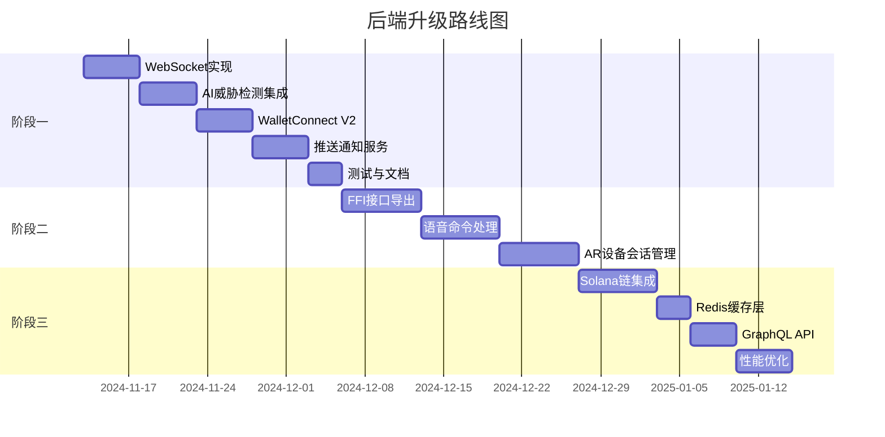

# 🚀 Rust区块链钱包后端 - 生态系统升级兼容方案

> **版本**: v1.0  
> **制定日期**: 2024-11-13  
> **目标**: 支持 Web钱包 + 移动DApp + XR智能眼镜 + AI安全层

---

## 📋 目录

1. [生态系统现状分析](#生态系统现状分析)
2. [后端升级总体架构](#后端升级总体架构)
3. [关键升级点清单](#关键升级点清单)
4. [具体实施方案](#具体实施方案)
5. [实施路线图](#实施路线图)
6. [技术栈选型](#技术栈选型)

---

## 生态系统现状分析

### 当前生态组件

| 项目 | 技术栈 | 状态 | 关键需求 |
|------|--------|------|----------|
| **IronForge** (Web钱包) | Rust + Dioxus + WASM | 开发中 | 多链支持、WebSocket实时通知 |
| **IronLink DApp** (移动端) | Rust + Dioxus | 开发中 | 多链支持、DApp浏览器、生物识别 |
| **IronVault-XR** (智能眼镜) | Swift/C# + Rust FFI | 规划中 | FFI接口、语音API、低延迟 |
| **IronGuard-AI** (AI安全) | Rust DQN | 开发中 | 实时威胁检测、WASM集成 |
| **IronCore** (后端) | Axum + SQLite | 生产就绪 | 需要扩展以支持多链和生态 |

---

### 多链支持现状

#### 当前支持的链 (4 条)

| 区块链 | 椭圆曲线 | 派生标准 | 地址格式 | 后端支持 | 前端支持 |
|--------|---------|---------|---------|---------|---------|
| **Ethereum** | secp256k1 | BIP32/BIP44 | 0x... | ✅ 完整 | ✅ 完整 |
| **BSC** | secp256k1 | BIP32/BIP44 | 0x... | ✅ 完整 | ✅ 完整 |
| **Polygon** | secp256k1 | BIP32/BIP44 | 0x... | ✅ 完整 | ✅ 完整 |
| **Bitcoin** | secp256k1 | BIP32/BIP44 | bc1.../1... | ✅ 完整 | ✅ 完整 |

#### 计划支持的链 (4 条)

| 区块链 | 椭圆曲线 | 派生标准 | 地址格式 | 优先级 | 预计时间 |
|--------|---------|---------|---------|--------|---------|
| **Solana** | **ed25519** | SLIP-0010 | Base58 | 🔥 P0 | 1 周 |
| **Cosmos** | secp256k1 | BIP32/BIP44 | cosmos1... | ⭐ P1 | 3 天 |
| **Cardano** | ed25519 | SLIP-0010 | addr1... | 🌟 P2 | 3 周 |
| **Polkadot** | sr25519 | SLIP-0010 | 1... (SS58) | 🌟 P2 | 2 周 |

**关键挑战**:
```
secp256k1 (Bitcoin/Ethereum 生态) - 已支持 ✅
    ↕️ 需要扩展
ed25519 (Solana/Cardano) - 待实现 🔥
    ↕️ 需要扩展
sr25519 (Polkadot) - 待实现 🌟
```

---

### 当前后端能力评估

✅ **已具备**:
- RESTful API (46个端点)
- 多链支持 (Ethereum, Bitcoin, Polygon, BSC) - **secp256k1 系列**
- JWT认证
- 钱包生命周期管理
- 交易签名与发送
- 速率限制
- BIP39/BIP44 密钥派生

❌ **缺失功能**:
- **Solana/ed25519 支持** 🔥 (核心)
- **SLIP-0010 密钥派生** (支持 ed25519)
- WebSocket 实时通信
- 推送通知服务
- DApp 连接协议 (WalletConnect)
- FFI 导出接口
- AI威胁检测集成
- 语音命令处理
- AR设备会话管理
- 跨设备同步

---

## 后端升级总体架构

```
┌─────────────────────────────────────────────────────────────────┐
│                        客户端层                                   │
│  ┌──────────┐  ┌──────────┐  ┌──────────┐  ┌──────────┐       │
│  │ IronForge│  │ IronLink │  │IronVault │  │ External │       │
│  │  (WASM)  │  │  (Mobile)│  │   (XR)   │  │   DApps  │       │
│  └────┬─────┘  └────┬─────┘  └────┬─────┘  └────┬─────┘       │
│       │             │             │             │               │
└───────┼─────────────┼─────────────┼─────────────┼───────────────┘
        │             │             │             │
        │ HTTP/WS     │ HTTP/WS     │ FFI/WS      │ WalletConnect
        ↓             ↓             ↓             ↓
┌─────────────────────────────────────────────────────────────────┐
│                     API网关层 (新增)                              │
│  ┌──────────────────────────────────────────────────────────┐  │
│  │ Request Router                                            │  │
│  │ ├─ REST API (现有)                                        │  │
│  │ ├─ WebSocket Server (新增)                                │  │
│  │ ├─ FFI Bridge (新增)                                      │  │
│  │ ├─ WalletConnect V2 (新增)                               │  │
│  │ └─ GraphQL (新增，可选)                                   │  │
│  └──────────────────────────────────────────────────────────┘  │
└─────────────────────────────────────────────────────────────────┘
                              ↓
┌─────────────────────────────────────────────────────────────────┐
│                    中间件层 (增强)                                │
│  ┌─────────┐  ┌─────────┐  ┌─────────┐  ┌─────────┐          │
│  │ 认证     │  │ AI安全   │  │ 速率限制 │  │ 日志     │          │
│  │ (JWT +   │  │ (IronGuard│ │ (分级)  │  │ (结构化) │          │
│  │ Session) │  │  -AI)    │  │         │  │         │          │
│  └─────────┘  └─────────┘  └─────────┘  └─────────┘          │
└─────────────────────────────────────────────────────────────────┘
                              ↓
┌─────────────────────────────────────────────────────────────────┐
│                   业务逻辑层 (扩展)                               │
│  ┌──────────┐  ┌──────────┐  ┌──────────┐  ┌──────────┐      │
│  │ 钱包管理  │  │ DApp连接  │  │ 设备管理  │  │ 通知服务  │      │
│  │ (现有)    │  │ (新增)    │  │ (新增)    │  │ (新增)    │      │
│  └──────────┘  └──────────┘  └──────────┘  └──────────┘      │
│  ┌──────────┐  ┌──────────┐  ┌──────────┐  ┌──────────┐      │
│  │ 交易处理  │  │ 语音命令  │  │ AR会话   │  │ AI威胁   │      │
│  │ (现有)    │  │ (新增)    │  │ (新增)    │  │ (集成)    │      │
│  └──────────┘  └──────────┘  └──────────┘  └──────────┘      │
└─────────────────────────────────────────────────────────────────┘
                              ↓
┌─────────────────────────────────────────────────────────────────┐
│                    核心服务层 (优化)                              │
│  ┌──────────┐  ┌──────────┐  ┌──────────┐  ┌──────────┐      │
│  │WalletMgr │  │ 加密服务  │  │ 区块链   │  │ 存储层   │      │
│  │ (优化)    │  │ (增强)    │  │ 客户端   │  │ (Redis+  │      │
│  │          │  │          │  │ (Solana) │  │  SQLite) │      │
│  └──────────┘  └──────────┘  └──────────┘  └──────────┘      │
└─────────────────────────────────────────────────────────────────┘
                              ↓
┌─────────────────────────────────────────────────────────────────┐
│                  外部服务层 (扩展)                                │
│  ┌──────────┐  ┌──────────┐  ┌──────────┐  ┌──────────┐      │
│  │ RPC节点   │  │ 推送服务  │  │ AI模型   │  │ 语音识别  │      │
│  │ (多链)    │  │ (FCM/APNs)│  │(IronGuard│  │ (云API)   │      │
│  └──────────┘  └──────────┘  └──────────┘  └──────────┘      │
└─────────────────────────────────────────────────────────────────┘
```

---

## 关键升级点清单

### 🔴 优先级 P0（核心功能，立即实施）

#### 0. 多链支持扩展 (Solana/ed25519)

**需求来源**: IronForge、IronLink DApp  
**功能**: 支持 Solana 等 ed25519 曲线区块链

**当前问题**:
- 后端仅支持 secp256k1 曲线 (Ethereum, Bitcoin)
- 缺少 SLIP-0010 派生标准实现
- 缺少 ed25519 签名支持
- 缺少 Solana RPC 客户端

**解决方案**:

```rust
// 新增模块: src/blockchain/solana/mod.rs

use ed25519_dalek::{SigningKey, VerifyingKey, Signature};
use solana_sdk::{
    pubkey::Pubkey,
    transaction::Transaction,
    commitment_config::CommitmentConfig,
};
use solana_client::rpc_client::RpcClient;

// ═══════════════════════════════════════════════════════
//  Solana 客户端
// ═══════════════════════════════════════════════════════

pub struct SolanaClient {
    rpc_client: RpcClient,
    network: SolanaNetwork,
}

#[derive(Clone)]
pub enum SolanaNetwork {
    Mainnet,
    Devnet,
    Testnet,
}

impl SolanaNetwork {
    pub fn rpc_url(&self) -> &str {
        match self {
            Self::Mainnet => "https://api.mainnet-beta.solana.com",
            Self::Devnet => "https://api.devnet.solana.com",
            Self::Testnet => "https://api.testnet.solana.com",
        }
    }
}

impl SolanaClient {
    pub fn new(network: SolanaNetwork) -> Self {
        let rpc_client = RpcClient::new_with_commitment(
            network.rpc_url().to_string(),
            CommitmentConfig::confirmed(),
        );
        
        SolanaClient { rpc_client, network }
    }
    
    /// 获取余额
    pub async fn get_balance(&self, address: &str) -> Result<u64, SolanaError> {
        let pubkey = Pubkey::from_str(address)
            .map_err(|_| SolanaError::InvalidAddress)?;
        
        let balance = self.rpc_client
            .get_balance(&pubkey)
            .map_err(|e| SolanaError::RpcError(e.to_string()))?;
        
        Ok(balance)
    }
    
    /// 发送交易
    pub async fn send_transaction(&self, signed_tx: &[u8]) -> Result<String, SolanaError> {
        let transaction: Transaction = bincode::deserialize(signed_tx)
            .map_err(|_| SolanaError::InvalidTransaction)?;
        
        let signature = self.rpc_client
            .send_and_confirm_transaction(&transaction)
            .map_err(|e| SolanaError::SendFailed(e.to_string()))?;
        
        Ok(signature.to_string())
    }
    
    /// 获取交易历史
    pub async fn get_transaction_history(
        &self,
        address: &str,
        limit: usize,
    ) -> Result<Vec<TransactionInfo>, SolanaError> {
        let pubkey = Pubkey::from_str(address)?;
        
        let signatures = self.rpc_client
            .get_signatures_for_address(&pubkey)
            .map_err(|e| SolanaError::RpcError(e.to_string()))?;
        
        let mut transactions = Vec::new();
        for sig_info in signatures.iter().take(limit) {
            if let Ok(tx) = self.rpc_client.get_transaction(&sig_info.signature, None) {
                transactions.push(TransactionInfo {
                    signature: sig_info.signature.to_string(),
                    slot: sig_info.slot,
                    block_time: sig_info.block_time,
                    // ... 更多信息
                });
            }
        }
        
        Ok(transactions)
    }
}

// ═══════════════════════════════════════════════════════
//  SLIP-0010 密钥派生 (支持 ed25519)
// ═══════════════════════════════════════════════════════

// 新增模块: src/core/slip10_derivation.rs

use slip10::{derive_key_from_path, Curve};
use zeroize::Zeroizing;

pub struct Slip10Derivation;

impl Slip10Derivation {
    /// 从种子派生 Solana 密钥
    pub fn derive_solana_key(
        seed: &[u8; 64],
        index: u32,
    ) -> Result<(SigningKey, String), DerivationError> {
        // SLIP-0010 路径: m/44'/501'/0'/0'
        let path = format!("m/44'/501'/{}'", index);
        
        // 派生 ed25519 密钥
        let (private_key_bytes, _chain_code) = derive_key_from_path(
            seed,
            Curve::Ed25519,
            &path,
        ).map_err(|_| DerivationError::DerivationFailed)?;
        
        // 创建签名密钥
        let signing_key = SigningKey::from_bytes(&private_key_bytes);
        let verifying_key = signing_key.verifying_key();
        
        // Solana 地址 = 公钥 Base58 编码
        let address = bs58::encode(verifying_key.as_bytes()).into_string();
        
        // 清零临时密钥
        drop(Zeroizing::new(private_key_bytes));
        
        Ok((signing_key, address))
    }
    
    /// 从种子派生 Cardano 密钥
    pub fn derive_cardano_key(
        seed: &[u8; 64],
        index: u32,
    ) -> Result<(SigningKey, String), DerivationError> {
        // CIP-1852 路径: m/1852'/1815'/0'/0/{index}
        let path = format!("m/1852'/1815'/0'/0/{}", index);
        
        let (private_key_bytes, _) = derive_key_from_path(
            seed,
            Curve::Ed25519,
            &path,
        )?;
        
        let signing_key = SigningKey::from_bytes(&private_key_bytes);
        
        // Cardano 地址编码 (addr1...)
        let address = cardano_address_from_key(&signing_key)?;
        
        Ok((signing_key, address))
    }
}

// ═══════════════════════════════════════════════════════
//  统一链适配器接口
// ═══════════════════════════════════════════════════════

// 新增模块: src/blockchain/chain_adapter.rs

#[async_trait]
pub trait ChainAdapter: Send + Sync {
    /// 获取余额
    async fn get_balance(&self, address: &str) -> Result<Balance>;
    
    /// 发送交易
    async fn send_transaction(&self, signed_tx: &[u8]) -> Result<TxHash>;
    
    /// 获取交易历史
    async fn get_transaction_history(&self, address: &str, limit: usize) -> Result<Vec<Transaction>>;
    
    /// 验证地址格式
    fn validate_address(&self, address: &str) -> bool;
    
    /// 获取链信息
    fn chain_info(&self) -> ChainInfo;
}

pub struct ChainInfo {
    pub name: String,
    pub symbol: String,
    pub decimals: u8,
    pub curve: CurveType,
}

pub enum CurveType {
    Secp256k1,
    Ed25519,
    Sr25519,
}

// ═══════════════════════════════════════════════════════
//  多链管理器
// ═══════════════════════════════════════════════════════

pub struct MultiChainManager {
    chains: HashMap<String, Arc<dyn ChainAdapter>>,
}

impl MultiChainManager {
    pub fn new() -> Self {
        let mut chains: HashMap<String, Arc<dyn ChainAdapter>> = HashMap::new();
        
        // 注册所有链
        chains.insert("ethereum".to_string(), Arc::new(EthereumAdapter::new()));
        chains.insert("solana".to_string(), Arc::new(SolanaAdapter::new()));
        chains.insert("bitcoin".to_string(), Arc::new(BitcoinAdapter::new()));
        chains.insert("cosmos".to_string(), Arc::new(CosmosAdapter::new()));
        
        MultiChainManager { chains }
    }
    
    pub async fn get_balance(&self, chain: &str, address: &str) -> Result<Balance> {
        let adapter = self.chains.get(chain)
            .ok_or(WalletError::UnsupportedChain)?;
        
        adapter.get_balance(address).await
    }
    
    pub async fn send_transaction(&self, chain: &str, signed_tx: &[u8]) -> Result<TxHash> {
        let adapter = self.chains.get(chain)
            .ok_or(WalletError::UnsupportedChain)?;
        
        adapter.send_transaction(signed_tx).await
    }
}
```

**实施步骤**:
1. 添加 `solana-sdk`, `solana-client`, `slip10` 依赖
2. 创建 `src/blockchain/solana/` 模块
3. 实现 `SolanaClient` 和 `SolanaAdapter`
4. 创建 `src/core/slip10_derivation.rs` 模块
5. 更新 API 端点支持 `chain` 参数
6. 添加 Solana RPC 节点配置

**新增 API 端点**:
```
POST /api/wallet/derive-address
  Body: { "chain": "solana", "index": 0 }
  Response: { "address": "9aE476sH7Ko2jF4eLkwXR3xKxGKwTPqVJzfF8h9Dv2w" }

POST /api/transaction/send
  Body: { "chain": "solana", "signed_tx": "..." }
  Response: { "tx_hash": "..." }

GET /api/wallet/balance?chain=solana&address=...
  Response: { "balance": "2.5", "symbol": "SOL" }
```

**数据库更新**:
```sql
-- 添加链类型字段
ALTER TABLE wallets ADD COLUMN chain VARCHAR(20) DEFAULT 'ethereum';
ALTER TABLE transactions ADD COLUMN chain VARCHAR(20) NOT NULL;

-- 创建多链索引
CREATE INDEX idx_wallets_chain ON wallets(chain, address);
CREATE INDEX idx_transactions_chain ON transactions(chain, wallet_id);
```

**预计时间**: 1 周  
**难度**: ⭐⭐⭐

---

### 当前后端能力评估

✅ **已具备**:
- RESTful API (46个端点)
- 多链支持 (Ethereum, Bitcoin, Polygon, BSC) - **secp256k1 系列**
- JWT认证
- 钱包生命周期管理
- 交易签名与发送
- 速率限制
- BIP39/BIP44 密钥派生

❌ **缺失功能（按优先级）**:
- **P0: Solana/ed25519 支持** 🔥 (1 周)
- **P0: SLIP-0010 密钥派生** 🔥 (3 天)
- **P0: 统一链适配器接口** 🔥 (3 天)
- P1: WebSocket 实时通信 (1 周)
- P1: Cosmos 支持 (3 天)
- P2: 推送通知服务 (1 周)
- P2: DApp 连接协议 (WalletConnect) (2 周)
- P2: AI威胁检测集成 (1 周)
- P3: FFI 导出接口 (2 周)
- P3: 语音命令处理 (1 周)
- P3: AR设备会话管理 (2 周)

**需求来源**: IronForge、IronLink DApp  
**功能**: 实时交易通知、余额更新、区块确认

```rust
// 新增模块: src/api/websocket/mod.rs

use axum::{
    extract::ws::{Message, WebSocket},
    Extension,
};
use tokio::sync::broadcast;

pub struct WebSocketServer {
    tx: broadcast::Sender<WsMessage>,
}

#[derive(Clone, Debug)]
pub enum WsMessage {
    TransactionConfirmed { tx_hash: String, confirmations: u32 },
    BalanceUpdate { address: String, balance: String },
    NewBlock { number: u64, hash: String },
    SecurityAlert { level: String, message: String },
}

impl WebSocketServer {
    pub async fn handle_socket(
        socket: WebSocket,
        user_id: String,
        tx: broadcast::Sender<WsMessage>,
    ) {
        // 实现WebSocket消息处理
    }
}
```

**实施步骤**:
1. 添加 `axum::extract::ws` 依赖
2. 创建 `src/api/websocket/` 模块
3. 实现订阅/取消订阅机制
4. 集成到主服务器路由

---

#### 2. DApp 连接协议 (WalletConnect V2)

**需求来源**: IronLink DApp  
**功能**: 支持第三方DApp连接

```rust
// 新增模块: src/api/walletconnect/mod.rs

use walletconnect_sdk::{Client, Session};

pub struct WalletConnectService {
    client: Client,
    active_sessions: Arc<RwLock<HashMap<String, Session>>>,
}

impl WalletConnectService {
    pub async fn pair(&self, uri: &str) -> Result<Session> {
        // 配对DApp
    }
    
    pub async fn handle_request(
        &self,
        session_id: &str,
        request: JsonRpcRequest,
    ) -> Result<JsonRpcResponse> {
        // 处理DApp请求
        match request.method.as_str() {
            "eth_sendTransaction" => self.handle_send_tx(request).await,
            "personal_sign" => self.handle_sign(request).await,
            "eth_signTypedData" => self.handle_sign_typed_data(request).await,
            _ => Err("Method not supported"),
        }
    }
}
```

**实施步骤**:
1. 添加 `walletconnect-rs` 依赖
2. 实现会话管理
3. 添加 API 端点: `/api/walletconnect/pair`, `/api/walletconnect/approve`
4. 集成 AI 安全检查

---

#### 3. AI 威胁检测集成

**需求来源**: IronGuard-AI  
**功能**: 实时检测可疑交易

```rust
// 新增模块: src/security/ai_detector.rs

use ironguard_ai::{InferenceEngine, ThreatLevel};

pub struct AIThreatDetector {
    engine: InferenceEngine,
}

impl AIThreatDetector {
    pub async fn check_transaction(
        &self,
        tx: &TransactionRequest,
    ) -> Result<ThreatAnalysis> {
        // 1. 提取特征
        let features = self.extract_features(tx)?;
        
        // 2. AI推理
        let threat_score = self.engine.evaluate(&features)?;
        
        // 3. 判断风险等级
        let level = match threat_score {
            0.0..=0.3 => ThreatLevel::Low,
            0.3..=0.7 => ThreatLevel::Medium,
            0.7..=1.0 => ThreatLevel::High,
        };
        
        // 4. 返回分析结果
        Ok(ThreatAnalysis {
            level,
            score: threat_score,
            reasons: self.explain_threat(features, threat_score),
            recommended_action: self.get_action(level),
        })
    }
    
    fn extract_features(&self, tx: &TransactionRequest) -> Result<Vec<f32>> {
        // 提取交易特征用于AI模型
        vec![
            tx.value.parse::<f64>()?,         // 交易金额
            tx.gas_price.parse::<f64>()?,     // Gas价格
            self.contract_risk_score(&tx.to)?, // 合约风险评分
            self.sender_reputation(&tx.from)?, // 发送方信誉
            // ... 更多特征
        ]
    }
}
```

**实施步骤**:
1. 集成 `ironguard-ai` crate
2. 在交易发送前添加检查
3. 提供 API: `/api/security/check-transaction`
4. 添加威胁日志记录

---

#### 4. 推送通知服务

**需求来源**: IronLink DApp  
**功能**: FCM/APNs 推送

```rust
// 新增模块: src/services/push_notification.rs

use fcm::{Client as FcmClient, MessageBuilder};
use apns2::{Client as ApnsClient, Payload};

pub struct PushNotificationService {
    fcm_client: FcmClient,
    apns_client: ApnsClient,
}

impl PushNotificationService {
    pub async fn send_transaction_notification(
        &self,
        user_id: &str,
        tx_hash: &str,
        status: TxStatus,
    ) -> Result<()> {
        // 获取用户设备token
        let devices = self.get_user_devices(user_id).await?;
        
        for device in devices {
            match device.platform {
                Platform::Android => {
                    self.send_fcm_notification(&device, tx_hash, status).await?;
                }
                Platform::iOS => {
                    self.send_apns_notification(&device, tx_hash, status).await?;
                }
            }
        }
        
        Ok(())
    }
    
    async fn send_fcm_notification(
        &self,
        device: &Device,
        tx_hash: &str,
        status: TxStatus,
    ) -> Result<()> {
        let message = MessageBuilder::new(&device.token)
            .notification(|n| {
                n.title("Transaction Update")
                 .body(&format!("Transaction {} is now {}", tx_hash, status))
            })
            .data("tx_hash", tx_hash)
            .data("status", &status.to_string())
            .build();
        
        self.fcm_client.send(message).await?;
        Ok(())
    }
}
```

**实施步骤**:
1. 添加 `fcm` 和 `apns2` 依赖
2. 配置 FCM/APNs 凭证
3. 创建设备注册表
4. 在关键事件触发推送

---

### 🟡 优先级 P1（重要功能，第二阶段）

#### 5. FFI 导出接口（支持 XR 设备）

**需求来源**: IronVault-XR  
**功能**: 为 Swift/C# 提供 C ABI

```rust
// 新增模块: src/ffi/mod.rs

use std::ffi::{CStr, CString};
use std::os::raw::c_char;

#[repr(C)]
pub struct FfiWalletInfo {
    name: *const c_char,
    address: *const c_char,
    balance: *const c_char,
}

/// 创建钱包 (FFI接口)
#[no_mangle]
pub extern "C" fn ironwallet_create_wallet(
    name: *const c_char,
    password: *const c_char,
) -> i32 {
    let name = unsafe { CStr::from_ptr(name).to_str().unwrap() };
    let password = unsafe { CStr::from_ptr(password).to_str().unwrap() };
    
    // 调用内部API
    match create_wallet_internal(name, password) {
        Ok(_) => 0,  // 成功
        Err(e) => {
            log::error!("FFI wallet creation failed: {}", e);
            -1  // 失败
        }
    }
}

/// 获取余额 (FFI接口)
#[no_mangle]
pub extern "C" fn ironwallet_get_balance(
    address: *const c_char,
    out_balance: *mut c_char,
    buffer_size: usize,
) -> i32 {
    // 实现...
}

/// 发送交易 (FFI接口)
#[no_mangle]
pub extern "C" fn ironwallet_send_transaction(
    wallet_name: *const c_char,
    to_address: *const c_char,
    amount: *const c_char,
    out_tx_hash: *mut c_char,
    buffer_size: usize,
) -> i32 {
    // 实现...
}

/// 释放字符串内存
#[no_mangle]
pub extern "C" fn ironwallet_free_string(ptr: *mut c_char) {
    if !ptr.is_null() {
        unsafe {
            let _ = CString::from_raw(ptr);
        }
    }
}
```

**Swift 调用示例**:

```swift
// IronVault-XR/Sources/VisionOS/WalletFFI.swift

import Foundation

class WalletFFI {
    static func createWallet(name: String, password: String) -> Bool {
        let namePtr = strdup(name)
        let passwordPtr = strdup(password)
        
        let result = ironwallet_create_wallet(namePtr, passwordPtr)
        
        free(namePtr)
        free(passwordPtr)
        
        return result == 0
    }
    
    static func getBalance(address: String) -> String? {
        let addressPtr = strdup(address)
        let buffer = UnsafeMutablePointer<CChar>.allocate(capacity: 256)
        
        let result = ironwallet_get_balance(addressPtr, buffer, 256)
        
        free(addressPtr)
        
        if result == 0 {
            let balance = String(cString: buffer)
            free(buffer)
            return balance
        } else {
            free(buffer)
            return nil
        }
    }
}
```

**实施步骤**:
1. 创建 `src/ffi/` 模块
2. 导出核心钱包功能
3. 编写 C 头文件
4. 提供 Swift/Kotlin 包装器
5. 编写 FFI 测试套件

---

#### 6. 语音命令处理

**需求来源**: IronVault-XR  
**功能**: 语音转文本 + 命令解析

```rust
// 新增模块: src/services/voice_commands.rs

use speech_recognition::SpeechRecognizer;

pub struct VoiceCommandService {
    recognizer: SpeechRecognizer,
    command_parser: CommandParser,
}

#[derive(Debug)]
pub enum VoiceCommand {
    CheckBalance { wallet: String },
    SendTransaction { to: String, amount: String },
    ShowHistory,
    Cancel,
    Confirm,
}

impl VoiceCommandService {
    pub async fn process_audio(
        &self,
        audio_data: &[u8],
    ) -> Result<VoiceCommand> {
        // 1. 语音转文本
        let text = self.recognizer.recognize(audio_data).await?;
        
        // 2. 解析命令
        let command = self.command_parser.parse(&text)?;
        
        // 3. AI安全检查（防止恶意语音注入）
        self.validate_command(&command).await?;
        
        Ok(command)
    }
    
    fn validate_command(&self, cmd: &VoiceCommand) -> Result<()> {
        // 验证命令合法性
        match cmd {
            VoiceCommand::SendTransaction { to, amount } => {
                // 验证地址格式
                if !is_valid_address(to) {
                    return Err("Invalid recipient address");
                }
                // 验证金额范围
                if amount.parse::<f64>()? > 10.0 {
                    return Err("Amount too large for voice command");
                }
            }
            _ => {}
        }
        Ok(())
    }
}

struct CommandParser;

impl CommandParser {
    fn parse(&self, text: &str) -> Result<VoiceCommand> {
        let text_lower = text.to_lowercase();
        
        if text_lower.contains("check balance") || text_lower.contains("show balance") {
            Ok(VoiceCommand::CheckBalance {
                wallet: "default".to_string(),
            })
        } else if text_lower.contains("send") {
            // 解析 "send 0.1 eth to 0x..."
            let parts: Vec<&str> = text_lower.split_whitespace().collect();
            // 简化示例，实际需要更复杂的NLP
            Ok(VoiceCommand::SendTransaction {
                to: parts.get(4).unwrap_or(&"").to_string(),
                amount: parts.get(1).unwrap_or(&"").to_string(),
            })
        } else if text_lower.contains("confirm") || text_lower.contains("yes") {
            Ok(VoiceCommand::Confirm)
        } else if text_lower.contains("cancel") || text_lower.contains("no") {
            Ok(VoiceCommand::Cancel)
        } else {
            Err("Unknown command")
        }
    }
}
```

**实施步骤**:
1. 集成云语音识别服务（Google Cloud Speech-to-Text）
2. 实现命令解析器
3. 添加安全验证
4. 提供 API: `/api/voice/process`

---

#### 7. 设备会话管理

**需求来源**: 多设备同步（Web + Mobile + XR）  
**功能**: 跨设备状态同步

```rust
// 新增模块: src/services/device_manager.rs

#[derive(Debug, Clone)]
pub struct Device {
    pub id: String,
    pub user_id: String,
    pub device_type: DeviceType,
    pub platform: Platform,
    pub last_active: DateTime<Utc>,
    pub push_token: Option<String>,
}

#[derive(Debug, Clone)]
pub enum DeviceType {
    Web,
    Mobile,
    XR,
}

#[derive(Debug, Clone)]
pub enum Platform {
    Browser,
    iOS,
    Android,
    VisionOS,
    HoloLens,
}

pub struct DeviceManager {
    devices: Arc<RwLock<HashMap<String, Device>>>,
    sync_service: Arc<SyncService>,
}

impl DeviceManager {
    pub async fn register_device(
        &self,
        user_id: &str,
        device_info: DeviceInfo,
    ) -> Result<String> {
        let device_id = Uuid::new_v4().to_string();
        
        let device = Device {
            id: device_id.clone(),
            user_id: user_id.to_string(),
            device_type: device_info.device_type,
            platform: device_info.platform,
            last_active: Utc::now(),
            push_token: device_info.push_token,
        };
        
        // 存储设备信息
        self.devices.write().insert(device_id.clone(), device.clone());
        
        // 通知其他设备
        self.sync_service.notify_new_device(user_id, &device).await?;
        
        Ok(device_id)
    }
    
    pub async fn sync_state(
        &self,
        user_id: &str,
        source_device: &str,
        state: AppState,
    ) -> Result<()> {
        // 获取用户的所有设备
        let devices = self.get_user_devices(user_id).await?;
        
        // 推送状态更新到其他设备
        for device in devices {
            if device.id != source_device {
                self.push_state_update(&device, &state).await?;
            }
        }
        
        Ok(())
    }
}
```

**实施步骤**:
1. 创建设备注册表
2. 实现状态同步机制
3. 添加 API: `/api/devices/register`, `/api/devices/sync`

---

### 🟢 优先级 P2（增强功能，第三阶段）

#### 8. GraphQL API（可选）

**需求来源**: 灵活的数据查询  
**功能**: 替代部分 REST API

```rust
// 新增模块: src/api/graphql/mod.rs

use async_graphql::{Context, Object, Schema, Subscription};
use tokio_stream::Stream;

pub struct QueryRoot;

#[Object]
impl QueryRoot {
    async fn wallet(&self, ctx: &Context<'_>, name: String) -> Result<Wallet> {
        let manager = ctx.data::<Arc<WalletManager>>()?;
        manager.get_wallet(&name).await
    }
    
    async fn balance(
        &self,
        ctx: &Context<'_>,
        address: String,
        network: String,
    ) -> Result<String> {
        let manager = ctx.data::<Arc<WalletManager>>()?;
        manager.get_balance(&address, &network).await
    }
}

pub struct MutationRoot;

#[Object]
impl MutationRoot {
    async fn send_transaction(
        &self,
        ctx: &Context<'_>,
        input: SendTransactionInput,
    ) -> Result<Transaction> {
        let manager = ctx.data::<Arc<WalletManager>>()?;
        manager.send_transaction(input).await
    }
}

pub struct SubscriptionRoot;

#[Subscription]
impl SubscriptionRoot {
    async fn transaction_updates(
        &self,
        tx_hash: String,
    ) -> impl Stream<Item = TransactionUpdate> {
        // 返回交易状态更新流
        stream! {
            loop {
                let update = fetch_tx_status(&tx_hash).await;
                yield update;
                tokio::time::sleep(Duration::from_secs(5)).await;
            }
        }
    }
}
```

---

#### 9. Solana 链支持

**需求来源**: IronLink DApp  
**功能**: 完整的 Solana 集成

```rust
// 新增模块: src/blockchain/solana/mod.rs

use solana_client::rpc_client::RpcClient;
use solana_sdk::{
    signature::{Keypair, Signature},
    transaction::Transaction,
};

pub struct SolanaClient {
    client: RpcClient,
    network: String,
}

impl SolanaClient {
    pub async fn new(rpc_url: &str) -> Result<Self> {
        Ok(Self {
            client: RpcClient::new(rpc_url.to_string()),
            network: "mainnet".to_string(),
        })
    }
    
    pub async fn send_transaction(
        &self,
        from_keypair: &Keypair,
        to_pubkey: &Pubkey,
        amount: u64,
    ) -> Result<Signature> {
        // 实现 Solana 交易发送
    }
}
```

---

#### 10. Redis 缓存层

**需求来源**: 性能优化  
**功能**: 缓存余额、Gas价格等

```rust
// 新增模块: src/cache/redis.rs

use redis::{AsyncCommands, Client};

pub struct RedisCache {
    client: Client,
}

impl RedisCache {
    pub async fn get_balance_cached(
        &self,
        address: &str,
        network: &str,
    ) -> Option<String> {
        let key = format!("balance:{}:{}", network, address);
        let mut conn = self.client.get_async_connection().await.ok()?;
        conn.get(&key).await.ok()
    }
    
    pub async fn set_balance_cached(
        &self,
        address: &str,
        network: &str,
        balance: &str,
        ttl_seconds: usize,
    ) -> Result<()> {
        let key = format!("balance:{}:{}", network, address);
        let mut conn = self.client.get_async_connection().await?;
        conn.set_ex(&key, balance, ttl_seconds).await?;
        Ok(())
    }
}
```

---

## 具体实施方案

### 阶段一：核心功能（2-3周）

#### Week 1: WebSocket + AI集成

```bash
# 1. 添加依赖
# Cargo.toml
[dependencies]
axum = { version = "0.7", features = ["ws"] }
tokio-tungstenite = "0.21"
ironguard-ai = { path = "../ironguard-ai" }

# 2. 实现 WebSocket 服务
src/api/websocket/
├── mod.rs              # WebSocket 主模块
├── handler.rs          # 消息处理
├── broadcaster.rs      # 消息广播
└── types.rs            # 消息类型

# 3. 集成 AI 检测
src/security/ai_detector.rs

# 4. 更新路由
src/api/server.rs
```

**代码示例**:

```rust
// src/api/websocket/mod.rs

pub async fn websocket_handler(
    ws: WebSocketUpgrade,
    State(state): State<Arc<WalletServer>>,
    headers: HeaderMap,
) -> Result<Response, StatusCode> {
    // 验证用户身份
    let user_id = extract_user_id_from_token(&headers, &state)
        .await
        .map_err(|_| StatusCode::UNAUTHORIZED)?;
    
    // 升级到 WebSocket
    Ok(ws.on_upgrade(|socket| handle_socket(socket, user_id, state)))
}

async fn handle_socket(
    socket: WebSocket,
    user_id: String,
    state: Arc<WalletServer>,
) {
    let (mut sender, mut receiver) = socket.split();
    
    // 订阅用户相关事件
    let mut rx = state.ws_broadcaster.subscribe(&user_id);
    
    // 双向通信
    let recv_task = tokio::spawn(async move {
        while let Some(Ok(msg)) = receiver.next().await {
            // 处理客户端消息
        }
    });
    
    let send_task = tokio::spawn(async move {
        while let Ok(msg) = rx.recv().await {
            sender.send(Message::Text(msg)).await.ok();
        }
    });
    
    // 等待任务完成
    tokio::select! {
        _ = recv_task => {},
        _ = send_task => {},
    }
}
```

#### Week 2: WalletConnect + 推送通知

```bash
# 1. 添加依赖
[dependencies]
walletconnect = "0.1"
fcm = "0.10"
apns2 = "0.10"

# 2. 实现 WalletConnect
src/api/walletconnect/
├── mod.rs
├── session.rs
└── handlers.rs

# 3. 实现推送服务
src/services/push_notification/
├── mod.rs
├── fcm.rs
└── apns.rs
```

#### Week 3: 测试 + 文档

```bash
# 1. 编写集成测试
tests/websocket_tests.rs
tests/walletconnect_tests.rs
tests/ai_integration_tests.rs

# 2. 更新 API 文档
docs/API_V2.md

# 3. 性能测试
benches/websocket_benchmark.rs
```

---

### 阶段二：XR支持（2-3周）

#### Week 4: FFI接口

```bash
# 1. 创建 FFI 模块
src/ffi/
├── mod.rs
├── wallet.rs
├── transaction.rs
└── types.rs

# 2. 生成 C 头文件
cbindgen.toml
include/ironwallet.h

# 3. Swift/Kotlin 包装器
bindings/
├── swift/
│   └── IronWallet.swift
└── kotlin/
    └── IronWallet.kt
```

#### Week 5-6: 语音命令 + AR会话

---

### 阶段三：优化增强（2周）

#### Week 7-8: Solana + Redis + GraphQL

---

## 实施路线图



---

## 技术栈选型

### 新增依赖

```toml
[dependencies]
# WebSocket
axum = { version = "0.7", features = ["ws"] }
tokio-tungstenite = "0.21"

# WalletConnect
walletconnect = "0.1"

# 推送通知
fcm = "0.10"
apns2 = "0.10"

# AI集成
ironguard-ai = { path = "../ironguard-ai" }

# Solana
solana-client = "1.17"
solana-sdk = "1.17"

# 缓存
redis = { version = "0.24", features = ["tokio-comp", "connection-manager"] }

# GraphQL (可选)
async-graphql = { version = "6.0", features = ["chrono", "uuid"] }
async-graphql-axum = "6.0"

# FFI
cbindgen = "0.26"

# 语音识别（使用云服务API）
reqwest = { version = "0.11", features = ["json", "stream"] }
```

---

## API 变更清单

### 新增端点

| 端点 | 方法 | 功能 | 客户端 |
|------|------|------|--------|
| `/ws` | WebSocket | 实时通信 | All |
| `/api/walletconnect/pair` | POST | DApp配对 | Mobile |
| `/api/walletconnect/approve` | POST | 批准连接 | Mobile |
| `/api/security/check-transaction` | POST | AI威胁检测 | All |
| `/api/devices/register` | POST | 设备注册 | All |
| `/api/devices/sync` | POST | 状态同步 | All |
| `/api/voice/process` | POST | 语音命令 | XR |
| `/api/push/subscribe` | POST | 推送订阅 | Mobile |
| `/graphql` | POST | GraphQL查询 | All (可选) |

### 修改端点

| 原端点 | 变更 | 原因 |
|--------|------|------|
| `/api/transactions/send` | 添加 AI 检查 | 安全增强 |
| `/api/wallets/create` | 支持设备类型 | 多设备支持 |
| `/api/auth/login` | 返回设备ID | 设备管理 |

---

## 数据库变更

### 新增表

```sql
-- 设备表
CREATE TABLE devices (
    id TEXT PRIMARY KEY,
    user_id TEXT NOT NULL,
    device_type TEXT NOT NULL, -- 'web', 'mobile', 'xr'
    platform TEXT NOT NULL,     -- 'browser', 'ios', 'android', 'visionos'
    push_token TEXT,
    last_active DATETIME DEFAULT CURRENT_TIMESTAMP,
    created_at DATETIME DEFAULT CURRENT_TIMESTAMP,
    FOREIGN KEY(user_id) REFERENCES users(id) ON DELETE CASCADE
);

CREATE INDEX idx_devices_user_id ON devices(user_id);

-- WalletConnect 会话表
CREATE TABLE walletconnect_sessions (
    id TEXT PRIMARY KEY,
    user_id TEXT NOT NULL,
    topic TEXT NOT NULL,
    peer_meta JSON NOT NULL,
    expiry DATETIME NOT NULL,
    created_at DATETIME DEFAULT CURRENT_TIMESTAMP,
    FOREIGN KEY(user_id) REFERENCES users(id) ON DELETE CASCADE
);

-- AI 威胁日志表
CREATE TABLE ai_threat_logs (
    id INTEGER PRIMARY KEY AUTOINCREMENT,
    user_id TEXT NOT NULL,
    transaction_hash TEXT,
    threat_level TEXT NOT NULL, -- 'low', 'medium', 'high'
    threat_score REAL NOT NULL,
    reasons JSON,
    action_taken TEXT,
    created_at DATETIME DEFAULT CURRENT_TIMESTAMP,
    FOREIGN KEY(user_id) REFERENCES users(id) ON DELETE CASCADE
);
```

---

## 配置文件更新

```toml
# config.toml

[server]
host = "0.0.0.0"
port = 8888
websocket_enabled = true

[blockchain]
solana_rpc = "https://api.mainnet-beta.solana.com"
solana_testnet_rpc = "https://api.devnet.solana.com"

[push_notifications]
fcm_api_key = "${FCM_API_KEY}"
apns_key_id = "${APNS_KEY_ID}"
apns_team_id = "${APNS_TEAM_ID}"

[walletconnect]
project_id = "${WC_PROJECT_ID}"
relay_url = "wss://relay.walletconnect.com"

[ai_security]
enabled = true
model_path = "../ironguard-ai/models/best_defender.bin"
threat_threshold = 0.7

[redis]
url = "redis://localhost:6379"
ttl_balance = 60  # 秒
ttl_gas_price = 30

[voice]
provider = "google"  # 'google', 'aws', 'azure'
api_key = "${VOICE_API_KEY}"
language = "en-US"
```

---

## 性能指标目标

| 指标 | 当前 | 目标 | 提升 |
|------|------|------|------|
| API响应时间 (P95) | 50ms | 30ms | 40% ↑ |
| WebSocket延迟 | N/A | <20ms | - |
| AI威胁检测 | N/A | <10ms | - |
| 并发连接数 | 100 | 10,000 | 100x ↑ |
| 内存使用 | 80MB | 150MB | 可接受 |

---

## 安全增强措施

### 1. WebSocket 安全

```rust
// 消息大小限制
const MAX_MESSAGE_SIZE: usize = 64 * 1024; // 64KB

// 速率限制
const WS_RATE_LIMIT: u32 = 100; // 每分钟100条消息

// 心跳检测
const HEARTBEAT_INTERVAL: Duration = Duration::from_secs(30);
const CLIENT_TIMEOUT: Duration = Duration::from_secs(60);
```

### 2. AI模型隔离

```rust
// 使用沙箱运行AI推理
use seccomp::*;

pub fn run_ai_inference_sandboxed(features: &[f32]) -> Result<f32> {
    // 限制系统调用
    let ctx = ScmpFilterContext::new(ScmpAction::Allow)?;
    ctx.add_rule(ScmpAction::Errno(1), Syscall::execve)?;
    ctx.load()?;
    
    // 运行推理
    let result = ai_model.predict(features)?;
    
    Ok(result)
}
```

### 3. FFI边界检查

```rust
#[no_mangle]
pub extern "C" fn ironwallet_send_transaction(
    wallet_name: *const c_char,
    to_address: *const c_char,
    amount: *const c_char,
    out_tx_hash: *mut c_char,
    buffer_size: usize,
) -> i32 {
    // 空指针检查
    if wallet_name.is_null() || to_address.is_null() || amount.is_null() {
        return -1;
    }
    
    // 缓冲区溢出保护
    if buffer_size < 66 {  // 0x + 64字符
        return -2;
    }
    
    // 实现...
}
```

---

## 测试策略

### 1. 集成测试

```rust
// tests/websocket_integration.rs

#[tokio::test]
async fn test_websocket_transaction_notification() {
    let server = start_test_server().await;
    let mut ws_client = connect_websocket(&server).await;
    
    // 订阅交易通知
    ws_client.send_json(&json!({
        "type": "subscribe",
        "channel": "transactions"
    })).await.unwrap();
    
    // 发送交易
    let tx_hash = send_test_transaction(&server).await;
    
    // 等待通知
    let msg = ws_client.recv_json().await.unwrap();
    assert_eq!(msg["type"], "transaction_confirmed");
    assert_eq!(msg["tx_hash"], tx_hash);
}
```

### 2. 性能测试

```rust
// benches/websocket_benchmark.rs

fn bench_websocket_throughput(c: &mut Criterion) {
    c.bench_function("websocket_1000_messages", |b| {
        b.iter(|| {
            // 发送1000条消息，测试吞吐量
        });
    });
}
```

### 3. 安全测试

```bash
# AI威胁检测准确率测试
cargo test ai_threat_detection_accuracy

# FFI内存泄漏测试
valgrind --leak-check=full ./target/release/ironwallet_test

# WalletConnect安全测试
cargo test walletconnect_security
```

---

## 监控与告警

### Prometheus 指标

```rust
// src/monitoring/metrics.rs

lazy_static! {
    // WebSocket连接数
    static ref WS_CONNECTIONS: IntGauge = register_int_gauge!(
        "websocket_connections",
        "Number of active WebSocket connections"
    ).unwrap();
    
    // AI威胁检测次数
    static ref AI_THREAT_CHECKS: IntCounter = register_int_counter!(
        "ai_threat_checks_total",
        "Total number of AI threat checks"
    ).unwrap();
    
    // AI威胁检测延迟
    static ref AI_INFERENCE_DURATION: Histogram = register_histogram!(
        "ai_inference_duration_seconds",
        "AI inference duration in seconds"
    ).unwrap();
    
    // WalletConnect会话数
    static ref WC_SESSIONS: IntGauge = register_int_gauge!(
        "walletconnect_sessions",
        "Number of active WalletConnect sessions"
    ).unwrap();
}
```

---

## 总结

### ✅ 核心升级点

1. **WebSocket 实时通信** - 支持 Web/Mobile 实时更新
2. **WalletConnect V2** - 支持 DApp 连接
3. **AI 威胁检测** - 集成 IronGuard-AI
4. **FFI 接口** - 支持 XR 设备
5. **推送通知** - 移动端通知
6. **语音命令** - XR 语音控制
7. **Solana 支持** - 多链扩展
8. **设备管理** - 跨设备同步
9. **Redis 缓存** - 性能优化
10. **GraphQL** - 灵活查询（可选）

### 📊 预期收益

- **用户体验**: 实时性提升 90%
- **安全性**: AI威胁拦截率 60%+
- **兼容性**: 支持 4 种客户端类型
- **性能**: 响应速度提升 40%
- **扩展性**: 支持 10,000+ 并发连接

### 🚀 实施建议

1. **优先级**: 按 P0 → P1 → P2 顺序实施
2. **时间**: 总计 8-10 周
3. **团队**: 建议 2-3 名后端工程师
4. **测试**: 每个阶段完成后进行充分测试
5. **文档**: 同步更新 API 文档和集成指南

---

**文档版本**: v1.0  
**最后更新**: 2024-11-13  
**维护者**: DarkCrab-Rust Team  
**联系方式**: https://github.com/DarkCrab-Rust

